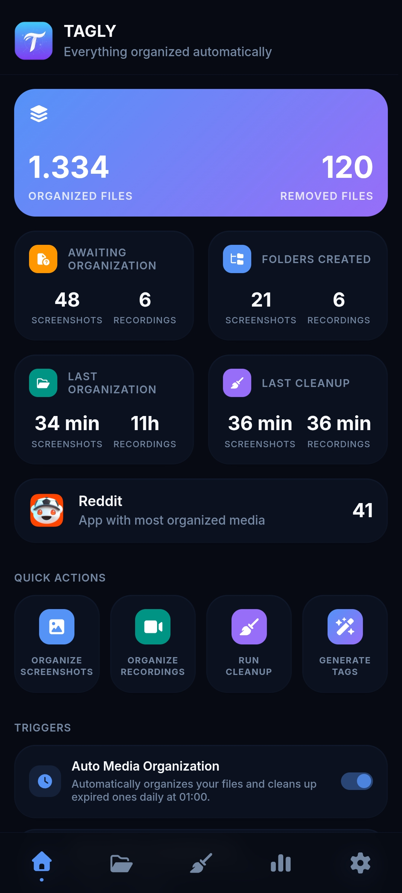

<table align="right">
  <tr>
    <td height="43px">
      <b>
        <a href="README.pt.md">Portuguese 🇧🇷</a>
      </b>
    </td>
  </tr>
</table>

<h1 align="center">Tagly</h1>

<p align="center">
  Smart screenshot and screen recording organizer for Android. Groups media by app, analyzes and generates AI-powered tags, enables instant content search, and automatically removes old files using configurable retention rules per folder.
</p>

<p align="center">
  
  
  
  
  
</p>

<div align="center">
  
</div>

## 🚀 Why Tagly?

- **📂 Automatic organization**: groups screenshots and recordings into app-based subfolders without manual configuration.
- **🤖 AI-generated tags**: uses the Gemini API to analyze visual content and embed tags directly into file names.
- **🔍 Instant search**: find any media by tag or app name in real time.
- **🧹 Configurable cleanup**: independent retention rules for each folder and media type.
- **🌐 Multilingual**: available in Portuguese, English, and Spanish.

## 📦 Installation

### Production (via Tasker)

1. Import the project from [TaskerNet](https://taskernet.com/shares/?user=AS35m8k%2FEQCE%2BJiPvkN1cJcjBE7Yh%2B%2Fa8zZeifxINYS7E94XnS26HrYYgsweBVnbf2VB9WJdrS5k&id=Project%3ATAGLY)
2. Run the **TG 01 - MAIN** task
3. In **Settings**, configure the source folders for **screenshots** and **screen recordings**
4. In **Settings → Gemini AI**, add your Gemini API keys

> Get a free API key from Google AI Studio.

### Local Development

```bash
git clone https://github.com/x-mrrobot-x/tagly.git
cd tagly
npm install
npm run dev
```

### Available Scripts

| Command                | Description                 |
| ---------------------- | --------------------------- |
| `npm run dev`          | Development environment     |
| `npm run build:main`   | Main interface build        |
| `npm run build:tasker` | Background processing build |
| `npm run build:all`    | Runs all build processes    |

## 🚀 Getting Started

### 1. Organize Media

```txt
Dashboard → "Organize Captures" or "Organize Recordings"
→ files moved to subfolders by app
```

### 2. Generate Tags for Media

```txt
Dashboard → "Generate Tags"  (or Organization → FAB Button ✦)
→ Gemini analyzes each media file and applies tags to the filename
```

### 3. Search Media by Tags

```txt
Organization → search field → type a tag or app name
→ results shown in found folders and individual files
```

## 📋 Features

### 📂 Media Organization

Scans screenshot and recording source folders and moves each file into a subfolder named after the app identified in the file name.

```text
# Before
Screenshots/
├── Screenshot_2026-01-01_com.whatsapp.png
└── Screenshot_2026-01-02_com.instagram.png

# After
Screenshots/Tagly/
├── Whatsapp/
│   └── Screenshot_2026-01-01_com.whatsapp.png
└── Instagram/
    └── Screenshot_2026-01-02_com.instagram.png
```

### 🤖 AI Tag Generation

Uses the **Gemini API** to analyze screenshots and screen recordings, automatically generating descriptive tags based on visual content. Tags are added directly to file names and can later be used to quickly locate media files.

When clicking **Generate Tags**, a dialog displays media files that do not yet have tags, allowing them to be analyzed individually or in batches. During processing, progress indicators show how many files are pending, tagged, or skipped.

| Action                    | Behavior                                                                    |
| ------------------------- | --------------------------------------------------------------------------- |
| **Generate Tags**         | Analyzes the current media file and automatically adds content-related tags |
| **Skip**                  | Marks the current media file as skipped                                     |
| **Generate Tags for All** | Automatically analyzes all pending media files in the queue                 |
| **Skip All**              | Marks all pending media files as skipped                                    |
| **Stop**                  | Interrupts batch processing while preserving completed progress             |

**Automatic key rotation:** when usage limits are reached, Tagly automatically switches between configured Gemini API keys and models.

### 🔍 Media Search

AI-generated tags are used by Tagly's search engine, allowing screenshots and recordings to be quickly located through keywords related to their content.

Search is available on the **Organizer** page and updates instantly while typing.

Two search modes are available:

- **Search across all folders** — searches simultaneously by app name and tags across all organized media of the currently selected type (**screenshots** or **recordings**)
- **Search within folder** — searches only the media inside the currently opened folder using the tags associated with each file

### 📁 Media Explorer

On the **Organizer** page, browse and view screenshots and recordings organized by Tagly through an app-based interface.

The main view displays a grid of folders grouped by application, showing information related to the currently selected media type (**screenshots** or **recordings**).

Inside a folder, media files can be filtered by status (**All**, **Tagged**, **Pending**, and **Skipped**) and images, videos, and their associated tags can be viewed.

Tapping a media file opens the **Media Details** dialog, featuring full-screen preview, tag viewing and removal, and the ability to generate tags for files that have not yet been analyzed.

### ✅ Media Multi-Selection

Inside a folder, press and hold a media file to enter selection mode. Tap other media files to add or remove them from the selection.

When selection mode is active, a floating action bar appears at the bottom of the screen:

| Action            | Behavior                                                                                  |
| ----------------- | ----------------------------------------------------------------------------------------- |
| **Select All**    | Selects or deselects all currently visible media files; shows the count of selected items |
| **Generate Tags** | Opens the tag generation dialog with only the selected files that don't have tags yet     |
| **Share**         | Shares the selected files                                                                 |
| **Delete**        | Removes the selected files                                                                |
| **Cancel**        | Exits selection mode without performing any action                                        |

Selection mode can also be exited using Android's back gesture or back button.

### 🧹 Automatic Cleanup

Configure independent cleanup rules for each organized folder and media type. Only folders and media types explicitly enabled will be included in the cleanup process.

For each folder, you can:

- Enable or disable automatic screenshot cleanup
- Enable or disable automatic screen recording cleanup
- Define different retention periods for each media type

For example, the same folder can keep screenshots for **30 days** and recordings for only **7 days**, while other folders remain completely excluded from automatic cleanup.

Cleanup can be executed manually through the Dashboard's **Quick Actions** or automatically by Tasker according to the configured schedule.

## ⚙️ Main Settings

Open **Settings** to customize Tagly's behavior.

### Appearance

- **Theme** — Light, Dark, or Automatic (follows the system setting)

### Language

- **Português**, **English**, or **Español**

### Folders

Configure the directories used by Tagly:

- **Screenshot Source** — monitored folder for screenshots
- **Recording Source** — monitored folder for screen recordings
- **Screenshot Destination** — folder where organized screenshots are stored
- **Recording Destination** — folder where organized recordings are stored

### Notifications

Control which notifications are displayed:

- File organization results
- Automatic cleanup results
- Pending media reminders for tag generation

### Gemini AI

Configure the Gemini API integration used by Tagly to analyze media and generate tags automatically.

- Add one or more Gemini API keys
- Select the Gemini model used for tag generation

Get your API keys for free from Google AI Studio.

### Architecture

Modular architecture inspired by MVC. The `ENV` layer abstracts the execution environment (Tasker or browser), enabling full local development without Android.

```text
src/
├── core/
│   ├── platform/       # ENV (Web/Tasker), EventBus, Logger, TaskQueue
│   ├── services/       # ProcessEngine, I18n, AppMonitor, SubfolderMonitor
│   ├── state/          # AppState, ActivityHelper
│   └── ui/             # Navigation, Toast, History, Pagination, Thumbnails
├── features/
│   ├── dashboard/      # Dashboard, triggers, main process
│   │   └── process/    # script.sh (Android shell) + ProcessController
│   ├── organizer/      # Folder navigation and media browsing
│   │   └── tagging/    # Gemini tagging dialog
│   ├── cleaner/        # Folder-based cleanup rules
│   ├── stats/          # Activity charts and history
│   └── settings/       # General settings and Gemini integration
├── lib/                # gemini.js, image-utils.js, utils.js, defaults.js
├── i18n/               # pt.json, en.json, es.json
└── data/               # mock-env.js (development environment)

tasker/
├── TAGLY.prj.xml       # Tasker project (tasks, profiles, scenes)
├── auto-process.html   # Headless WebApp for background execution
└── runner.js           # Automatic process entry point
```

### Technologies

| Technology                      | Purpose                                                  |
| ------------------------------- | -------------------------------------------------------- |
| Vanilla JavaScript (ES Modules) | Entire UI and business logic without frameworks          |
| CSS Custom Properties           | Theming and dark/light mode support                      |
| Vite + `vite-plugin-singlefile` | Self-contained single HTML build                         |
| Chart.js                        | Weekly activity charts                                   |
| Gemini API (Google)             | Visual analysis and tag generation                       |
| POSIX Shell                     | Android file system operations                           |
| Tasker                          | Android automation engine (shell, events, notifications) |

## 🤝 Contributing

Contributions are welcome! Tagly is fully open source (MIT), and you can:

- Report bugs and suggest new features
- Improve the documentation
- Submit fixes and code improvements

To contribute:

1. Fork the repository and create a branch: `git checkout -b feat/my-feature`
2. Commit following Conventional Commits: `git commit -m 'feat: description'`
3. Push: `git push origin feat/my-feature`
4. Open a Pull Request

> When a `v*` tag is created, GitHub Actions automatically generates the changelog using the Gemini API and publishes a release containing the Tasker project XML.

## 📄 License

- **License**: [MIT](LICENSE)
