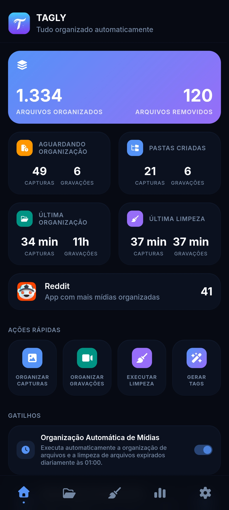

<table align="right">
  <tr>
    <td height="43px">
      <b>
        <a href="README.md">English 🇺🇸</a>
      </b>
    </td>
  </tr>
</table>

<h1 align="center">Tagly</h1>

<p align="center">
  Organizador inteligente de capturas e gravações de tela para Android. Agrupa mídias por aplicativo, analisa e gera tags com IA, permite busca instantânea por conteúdo, e remove arquivos antigos automaticamente com regras de retenção configuráveis por pasta.
</p>

<p align="center">
  
  
  
  
  
</p>

<div align="center">
  
</div>

## 🚀 Por que o Tagly?

- **📂 Organização automática**: agrupa screenshots e gravações em subpastas por aplicativo, sem configuração manual.
- **🤖 Tags geradas por IA**: usa a Gemini API para analisar o conteúdo visual e embutir tags diretamente no nome do arquivo.
- **🔍 Busca instantânea**: encontre qualquer mídia por tag ou nome de app em tempo real.
- **🧹 Limpeza configurável**: regras de retenção independentes por pasta e por tipo de mídia.
- **🌐 Multilíngue**: interface em Português, English e Español.

## 📦 Instalação

### Produção (via Tasker)

1. Importe o projeto da [TaskerNet](https://taskernet.com/shares/?user=AS35m8k%2FEQCE%2BJiPvkN1cJcjBE7Yh%2B%2Fa8zZeifxINYS7E94XnS26HrYYgsweBVnbf2VB9WJdrS5k&id=Project%3ATAGLY)
2. Execute a tarefa **TG 01 - MAIN**
3. Em **Configurações**, configure as pastas de origem das **capturas de tela** e **gravações de tela**
4. Em **Configurações → Gemini AI**, adicione as chaves da Gemini API

> Obtenha uma chave gratuita no [Google AI Studio](https://aistudio.google.com/apikey).

### Desenvolvimento Local

```bash
git clone https://github.com/x-mrrobot-x/tagly.git
cd tagly
npm install
npm run dev
```

### Scripts Disponíveis

| Comando                | Descrição                               |
| ---------------------- | --------------------------------------- |
| `npm run dev`          | Ambiente de desenvolvimento             |
| `npm run build:main`   | Build da interface principal            |
| `npm run build:tasker` | Build do processamento em segundo plano |
| `npm run build:all`    | Executa todos os builds                 |

## 🚀 Primeiros Passos

### 1. Organizar Mídias

```txt
Dashboard → "Organizar Capturas" ou "Organizar Gravações"
→ arquivos movidos para subpastas por app
```

### 2. Gerar Tags para as Mídias

```txt
Dashboard → "Gerar Tags"  (ou Organização → Botão FAB ✦)
→ Gemini analisa cada mídia e aplica tags no nome do arquivo
```

### 3. Buscar Mídias por Tags

```txt
Organização → campo de busca → digitar uma tag ou nome de app
→ resultados em pastas e arquivos individuais encontrados
```

## 📋 Funcionalidades

### 📂 Organização de Mídias

Escaneia as pastas de origem das screenshots e gravações e move cada arquivo para uma subpasta nomeada pelo aplicativo identificado no nome do arquivo.

```
#Antes
Screenshots/
├── Screenshot_2026-01-01_com.whatsapp.png
└── Screenshot_2026-01-02_com.instagram.png

#Depois
Screenshots/Tagly/
├── Whatsapp/
│   └── Screenshot_2026-01-01_com.whatsapp.png
└── Instagram/
    └── Screenshot_2026-01-02_com.instagram.png
```

### 🤖 Geração de Tags com IA

Utiliza a **Gemini API** para analisar screenshots e gravações de tela, gerando automaticamente tags descritivas com base no conteúdo visual. As tags são adicionadas diretamente ao nome do arquivo e podem ser utilizadas posteriormente para localizar mídias de forma rápida e organizada.

Ao clicar em **Gerar Tags**, é exibido um diálogo com as mídias que ainda não possuem tags, permitindo analisá-las individualmente ou em lote. Durante o processo, são exibidos indicadores de progresso mostrando quantos arquivos ainda estão pendentes, quantos já receberam tags e quantos foram ignorados.

| Ação                    | Comportamento                                                                      |
| ----------------------- | ---------------------------------------------------------------------------------- |
| **Gerar Tags**          | Analisa a mídia atual e adiciona automaticamente tags relacionadas ao seu conteúdo |
| **Ignorar**             | Marca a mídia atual como ignorada                                                  |
| **Gerar Tags em Todas** | Analisa automaticamente todas as mídias pendentes da fila                          |
| **Ignorar Todas**       | Marca todas as mídias pendentes como ignoradas                                     |
| **Parar**               | Interrompe o processamento em lote, preservando o progresso já realizado           |

**Rotação automática de chaves:** ao atingir limites de uso, o Tagly alterna automaticamente entre as chaves e modelos Gemini configurados.

### 🔍 Busca de Mídias

As tags geradas pela IA são utilizadas pelo mecanismo de busca do próprio Tagly, permitindo localizar rapidamente screenshots e gravações por meio de palavras-chave relacionadas ao seu conteúdo.

A busca está disponível na página **Organização** e possui atualização instantânea durante a digitação.

Existem dois modos de busca:

- **Busca em todas as pastas** — pesquisa simultaneamente por nome de aplicativo e por tags em todas as mídias organizadas do tipo atualmente selecionado (**capturas** ou **gravações**)
- **Busca dentro da pasta** — pesquisa apenas nas mídias da pasta aberta utilizando as tags associadas aos arquivos

### 📁 Exploração de Mídias

Na página **Organização**, navegue e visualize as capturas de tela e gravações organizadas pelo Tagly através de uma interface estruturada por aplicativos.

A visualização principal apresenta uma grade de pastas agrupadas por aplicativo, exibindo informações relacionadas ao tipo de mídia atualmente selecionado no filtro (**capturas** ou **gravações**).

Ao acessar uma pasta, é possível filtrar as mídias por status (**Todas**, **Com tags**, **Pendentes** e **Ignoradas**) e visualizar imagens, vídeos e suas respectivas tags.

Ao tocar em uma mídia, é aberto o diálogo **Detalhe da Mídia**, com visualização em tela cheia, exibição e remoção de tags, além da opção de gerar tags para arquivos que ainda não foram analisados.

### ✅ Multisseleção de Mídias

Dentro de uma pasta, mantenha o toque pressionado sobre uma mídia para ativar o modo de seleção. Toque em outras mídias para adicionar ou remover da seleção.

Ao entrar no modo de seleção, uma barra flutuante de ações é exibida na parte inferior da tela:

| Ação                | Comportamento                                                                                     |
| ------------------- | ------------------------------------------------------------------------------------------------- |
| **Selecionar Tudo** | Seleciona ou desmarca todas as mídias visíveis no momento; exibe a contagem de itens selecionados |
| **Gerar Tags**      | Abre o diálogo de geração de tags apenas com as mídias selecionadas que ainda não possuem tags    |
| **Compartilhar**    | Compartilha os arquivos selecionados                                                              |
| **Apagar**          | Remove os arquivos selecionados                                                                   |
| **Cancelar**        | Sai do modo de seleção sem executar nenhuma ação                                                  |

O modo de seleção também pode ser encerrado pelo botão/gesto de voltar do Android.

### 🧹 Limpeza Automática

Configure regras de limpeza independentes para cada pasta organizada e para cada tipo de mídia. Apenas as pastas e tipos de mídia que forem explicitamente habilitados serão incluídos no processo de limpeza.

Para cada pasta, é possível:

- Ativar ou desativar a limpeza automática de capturas de tela
- Ativar ou desativar a limpeza automática de gravações de tela
- Definir períodos de retenção diferentes para cada tipo de mídia

Por exemplo, uma mesma pasta pode manter capturas de tela por **30 dias** e gravações por apenas **7 dias**, enquanto outras pastas permanecem completamente excluídas da limpeza automática.

A limpeza pode ser executada manualmente pelas **Ações Rápidas** do Dashboard ou automaticamente pelo Tasker conforme o agendamento configurado.

## ⚙️ Configurações Principais

Acesse **Configurações** para personalizar o comportamento do Tagly.

### Aparência

- **Tema** — Claro, Escuro ou Automático (segue o sistema)

### Idioma

- **Português**, **English** ou **Español**

### Pastas

Configure os diretórios utilizados pelo Tagly:

- **Origem das Capturas** — pasta monitorada para screenshots
- **Origem das Gravações** — pasta monitorada para gravações de tela
- **Destino das Capturas** — pasta onde as screenshots organizadas serão armazenadas
- **Destino das Gravações** — pasta onde as gravações organizadas serão armazenadas

### Notificações

Controle quais notificações serão exibidas:

- Resultado da organização de arquivos
- Resultado da limpeza automática
- Avisos de mídias pendentes para geração de tags

### Gemini AI

Configure a integração com a Gemini API utilizada pelo Tagly para analisar mídias e gerar tags automaticamente.

- Adicione uma ou mais chaves da API Gemini
- Selecione o modelo Gemini utilizado na geração de tags

Obtenha suas chaves gratuitamente no [Google AI Studio](https://aistudio.google.com/apikey).

### Arquitetura

Arquitetura modular inspirada em MVC. A camada `ENV` abstrai o ambiente de execução (Tasker ou navegador), permitindo desenvolvimento local completo sem o Android.

```
src/
├── core/
│   ├── platform/       # ENV (Web/Tasker), EventBus, Logger, TaskQueue
│   ├── services/       # ProcessEngine, I18n, AppMonitor, SubfolderMonitor
│   ├── state/          # AppState, ActivityHelper
│   └── ui/             # Navigation, Toast, History, Pagination, Thumbnails
├── features/
│   ├── dashboard/      # Dashboard, gatilhos, processo principal
│   │   └── process/    # script.sh (shell Android) + ProcessController
│   ├── organizer/      # Navegação por pastas e visualização de mídias
│   │   └── tagging/    # Dialog de tagging com Gemini
│   ├── cleaner/        # Regras de limpeza por pasta
│   ├── stats/          # Gráficos e histórico de atividades
│   └── settings/       # Configurações gerais e Gemini
├── lib/                # gemini.js, image-utils.js, utils.js, defaults.js
├── i18n/               # pt.json, en.json, es.json
└── data/               # mock-env.js (ambiente de desenvolvimento)

tasker/
├── TAGLY.prj.xml       # Projeto Tasker (tasks, perfis, cenas)
├── auto-process.html   # WebApp headless para execução em background
└── runner.js           # Entry point do processo automático
```

### Tecnologias

| Tecnologia                      | Uso                                                       |
| ------------------------------- | --------------------------------------------------------- |
| Vanilla JavaScript (ES Modules) | Toda a lógica de UI e negócio, sem frameworks             |
| CSS Custom Properties           | Theming e suporte a dark/light mode                       |
| Vite + `vite-plugin-singlefile` | Build em HTML único autocontido                           |
| Chart.js                        | Gráficos de atividade semanal                             |
| Gemini API (Google)             | Análise visual e geração de tags                          |
| POSIX Shell                     | Operações no sistema de arquivos Android                  |
| Tasker                          | Motor de automação Android (shell, eventos, notificações) |

## 🤝 Contribuição

Contribuições são bem-vindas! O Tagly é totalmente open source (MIT), e você pode:

- Reportar bugs e sugerir funcionalidades
- Melhorar a documentação
- Enviar correções e melhorias de código

Para contribuir:

1. Fork o repositório e crie uma branch: `git checkout -b feat/minha-feature`
2. Commit seguindo [Conventional Commits](https://www.conventionalcommits.org/): `git commit -m 'feat: descrição'`
3. Push: `git push origin feat/minha-feature`
4. Abra um Pull Request

> Ao criar uma tag `v*`, o GitHub Actions gera automaticamente o changelog via Gemini API e publica a release com o XML do projeto Tasker.

## 📄 Licença

- **Licença**: [MIT](LICENSE)
